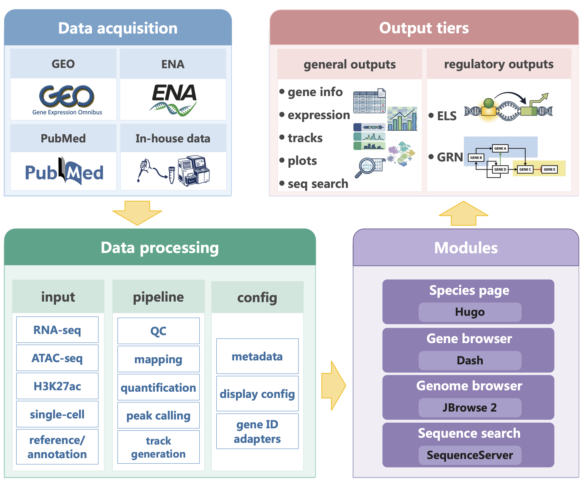
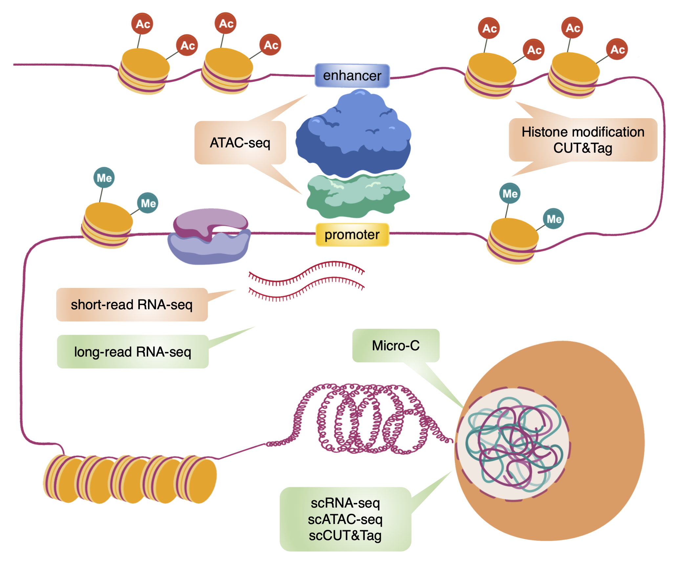

# Mini Omics Data Portal (miniODP)

miniODP is an open-source framework for building lightweight multi-omics portals for understudied and community-scale model organisms. It provides a reusable **analysis pipeline**, a configurable **web portal**, species-level configuration files, gene-ID adapters, data-conversion scripts, Docker runtime files, and deployment documentation.

## Table of Contents

- [Introduction](#introduction)
- [Quick Start](#quick-start)
- [Repository Guide](#repository-guide)
- [Documentation Map](#documentation-map)
- [Citation and License](#citation-and-license)

## Introduction

Large, well-established model-organism communities often have mature genome resources, curated annotations, and specialized data portals. Smaller or emerging model-organism communities usually need a more practical route. They may have a reference genome and scattered public datasets, but still need a way to **curate data**, **adapt gene identifiers**, **build genome tracks**, **connect gene and locus views**, and **deploy a maintainable website**.

miniODP addresses this need as a reusable framework rather than a fixed database for one species. A project can start with a genome reference, gene annotations, and bulk RNA-seq data, then add **genome-browser tracks**, **BLAST databases**, **single-cell modules**, and regulatory outputs such as **enhancer-like signatures** and **gene regulatory networks** when suitable data are available. The same codebase can support species with complete matched assays and species with only partial data.

<p align="center">
  
</p>

miniODP is paired with the miniENCODE core assay design. miniENCODE uses **RNA-seq**, **ATAC-seq**, and **H3K27ac profiling** as a practical starting set for regulatory analysis when resources are limited. RNA-seq measures gene expression, ATAC-seq maps accessible chromatin, and H3K27ac marks active regulatory regions. Together, these three layers support **enhancer-like signature calling**, **enhancer-gene linkage**, and **gene regulatory network inference** when matched samples are available. Optional assays such as long-read RNA-seq, Micro-C, and single-cell assays can be added when the biological question requires higher resolution.

<p align="center">
  
</p>

The repository supports two connected activities:

- **Analysis pipeline**: process and organize multi-omics data into reusable outputs.
- **Web portal**: publish processed data through species pages, gene-centered views, genome browsing, and sequence search.

## Quick Start

Choose the path that matches what you want to test first.

### Try the Portal Demo

Use this path to test the web portal components with a compact zebrafish example.

1. Read [demo/portal_demo/README.md](demo/portal_demo/README.md).
2. Download the portal demo package after the ScienceDB record is released.
3. Follow [docs/PORTAL_GUIDE.md](docs/PORTAL_GUIDE.md) to connect Hugo, Dash, JBrowse 2, and SequenceServer.

The portal demo validates data discovery, Dash gene views, single-cell modules, JBrowse 2 loading, and SequenceServer startup. It is a test package, not a full production deployment.

### Try the Pipeline Demo

Use this path to test the analysis workflow and container runtime.

1. Read [demo/pipeline_demo/README.md](demo/pipeline_demo/README.md).
2. Download the pipeline demo package after the ScienceDB record is released.
3. Start the runtime:

```bash
cd pipeline
docker compose run --rm pipeline bash
```

The pipeline demo is centered on zebrafish chromosome 1 and includes reference files, control tables, FASTQ files, representative intermediate outputs, and downstream analysis inputs.

### Add Your Own Species

Use this path if you want to prepare a new organism module.

1. Read [docs/ONBOARDING_GUIDE.md](docs/ONBOARDING_GUIDE.md).
2. Prepare input files listed in [docs/DATA_PREPARATION_GUIDE.md](docs/DATA_PREPARATION_GUIDE.md).
3. Convert species data for Dash, JBrowse 2, SequenceServer, and Hugo.
4. Use [docs/DEPLOYMENT_GUIDE.md](docs/DEPLOYMENT_GUIDE.md) when you are ready to deploy.

## Repository Guide

This section explains what is in the repository, what each part is responsible for, and where to look when adapting the framework.

### Repository Layout

- `pipeline/`: analysis scripts and the Docker runtime for omics processing and downstream analysis.
- `dash/`: interactive Dash applications, species adapters, data converters, and runtime data conventions.
- `hugo/`: static site source for the landing page, species cards, and species information pages.
- `jbrowse2/`: helper scripts for preparing JBrowse 2 references, metadata, tracks, and loader scripts.
- `sequenceserver/`: BLAST service configuration, database materialization scripts, and JBrowse link helpers.
- `common/`: shared images, Nginx reference config, GitHub release helpers, and other cross-component files.
- `demo/`: documentation for external demo packages distributed outside the repository.
- `docs/`: onboarding, data preparation, portal assembly, deployment, and maintenance-oriented public guides.

### Analysis Pipeline

The `pipeline/` module is the processing side of the project. It provides a containerized runtime for common multi-omics workflows and the scripts used to turn sequencing data into files that can be inspected, analyzed, and later published through the portal.

- reference preparation
- RNA-seq
- ATAC-seq
- ChIP-seq
- BS-seq
- enhancer-like signature analysis
- super-enhancer prediction
- gene regulatory network inference

Main files:

- [pipeline/README.md](pipeline/README.md)
- [pipeline/Dockerfile](pipeline/Dockerfile)
- [pipeline/docker-compose.yml](pipeline/docker-compose.yml)

You can use the image published on Docker Hub:

```bash
docker pull qtulab/miniodp-pipeline:latest
```

You can also build the image locally from the repository:

```bash
cd pipeline
docker build -t qtulab/miniodp-pipeline:latest .
```

### Web Portal

The web portal is the publishing side of the project. It combines static pages, interactive gene-centered applications, genome browsing, and sequence search so users can move from a species page to genes, loci, tracks, single-cell views, and BLAST hits.

- `hugo/` builds the public home page and species pages.
- `dash/` provides gene information, bulk RNA, scRNA, scATAC, and BulkMulti views.
- `jbrowse2/` prepares genome-browser references and tracks for a JBrowse 2 app.
- `sequenceserver/` manages BLAST databases and links genome hits back to JBrowse 2.
- `common/nginx/miniodp.conf` provides a reference route layout for deployment.

The Dash runtime image is published on Docker Hub:

```bash
docker pull qtulab/miniodp-dash:latest
```

You can also build the image locally:

```bash
cd dash
docker build -t qtulab/miniodp-dash:latest .
```

Typical local service commands:

```bash
cd dash
docker compose up -d
```

```bash
cd sequenceserver
docker compose up -d
```

Hugo is built as static content:

```bash
cd hugo
hugo --minify --config config/hugo_default.toml --baseURL https://example.org/miniodp/
```

### Demo Packages

The demo data are distributed outside this repository. The ScienceDB submission is currently under review. DOI and final download links will be added after release.

`portal_demo.tar.gz` (`1.7G`) validates the web portal side with a compact zebrafish subset. It includes example runtime data for Hugo, Dash, JBrowse 2, and SequenceServer. See [demo/portal_demo/README.md](demo/portal_demo/README.md).

`pipeline_demo.tar.gz` (`8.4G`) validates the analysis workflow with a compact zebrafish chromosome 1 example. It includes reference files, control tables, FASTQ files, representative intermediate outputs, and downstream analysis inputs. See [demo/pipeline_demo/README.md](demo/pipeline_demo/README.md).

The two archives are separate because they serve different use cases. Users who only want to test the portal do not need the pipeline package, and users who only want to inspect the workflow do not need the portal bundle.

### Adding a Species

A useful species module usually needs these inputs:

- species profile: common name, scientific name, short description, representative image, and display order
- genome reference: FASTA, chromosome sizes, and GFF3 or GTF annotation
- gene annotation table: gene ID, gene symbol, description, and optional functional annotations
- bulk omics data: quantification tables, BigWig files, peak files, sample metadata, run lists, and accession records
- single-cell data: Seurat object, H5AD file, or equivalent matrix with cell metadata and cell-type labels
- sequence-search data: genome, cDNA, and protein FASTA files when available

Start with [docs/ONBOARDING_GUIDE.md](docs/ONBOARDING_GUIDE.md) for the full species-onboarding path.

## Documentation Map

- [docs/ONBOARDING_GUIDE.md](docs/ONBOARDING_GUIDE.md): end-to-end path for testing the demo and adding a species
- [docs/DATA_PREPARATION_GUIDE.md](docs/DATA_PREPARATION_GUIDE.md): converted data expected by the portal modules
- [docs/PORTAL_GUIDE.md](docs/PORTAL_GUIDE.md): how Hugo, Dash, JBrowse 2, and SequenceServer fit together
- [docs/DEPLOYMENT_GUIDE.md](docs/DEPLOYMENT_GUIDE.md): recommended public deployment model
- [pipeline/README.md](pipeline/README.md): pipeline runtime, workflow order, and demo alignment
- [dash/README.md](dash/README.md): Dash app structure and development notes
- [hugo/README.md](hugo/README.md): static site and species page configuration
- [jbrowse2/README.md](jbrowse2/README.md): JBrowse 2 reference and track preparation
- [sequenceserver/README.md](sequenceserver/README.md): BLAST database management and JBrowse linking
- [demo/README.md](demo/README.md): overview of the external demo packages

## Citation and License

A manuscript describing miniODP is in preparation. The formal citation will be added after publication.

For now, please cite the repository and the release version you used:

QTu Lab. miniODP: a reusable framework for building multi-omics resources in understudied organisms. GitHub repository, `https://github.com/QTuLab/miniodp`.

This repository supersedes the legacy public miniENCODE repository as the main open-source home for the framework. The legacy repository remains available at `https://github.com/QTuLab/miniENCODE/`.

This repository is released under the MIT License.
